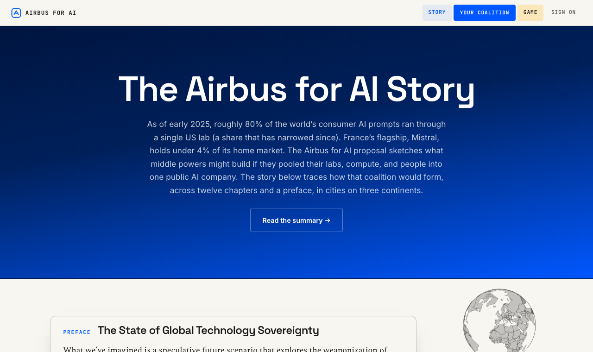
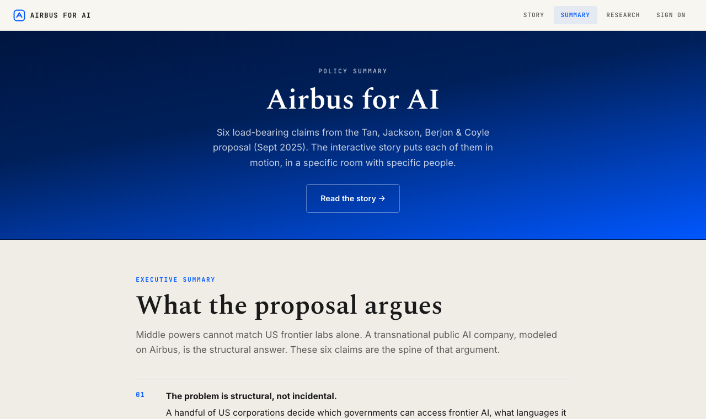

# The Airbus for AI Story: one-page overview

**What it is.** An interactive, near-future fiction that argues a policy idea: that middle powers (the EU and its democratic allies) could pool their AI labs, compute, and talent into a single public "Airbus for AI," the way European governments once pooled aerospace into Airbus to counter American dominance. It was made for the MetaGov Public AI Creative Fellowship (2025-2026) by Ahnjili ZhuParris, and is built on the Bennett School of Public Policy brief "Airbus for AI: A global strategy for public value creation" (Tan, Jackson, Berjon, Coyle, 2025).

**The premise.** Today most of the AI stack (chips, cloud, frontier models) sits with a handful of US companies, and Europe owns little beneath ASML's lithography. The story dramatizes what happens when that dependence is weaponized: a fictional US "Digital Liberty Act" sorts the world into Aligned, managed-access, and Restricted jurisdictions, and allies who keep trading with China are downgraded. Across twelve chapters set in 2026 and 2027, it follows journalists, ministers, engineers, and investors (New York, Dublin, Berlin, Brussels, Tokyo, Stockholm, Monroe, Ottawa, Paris, Washington) as a coalition forms.

**The data is real.** Every scene is paired with live-data charts grounded in cited sources: US versus EU private AI investment ($109B versus about $14B in 2024), talent migration, cloud dependence (about 72% US), pooled EuroHPC compute, the whiplash of US export controls, and more. Each figure links to its source (Stanford AI Index, Atomico, EuroHPC, BIS, and others), and hover tooltips explain terms like the CLOUD Act, FISA, and exaFLOPS.

**The game.** A companion to the story turns the argument into a sixteen-month strategy game: you play the coordinator trying to convene the coalition before the US "Digital Liberty Act" lands and forces everyone to pick a side. Each month you get two moves, paid for in political influence: court undecided states toward joining, pool their EuroHPC compute once two are in, fund a frontier lab before Washington buys it, or hedge public-sector cloud off the US hyperscalers. A live scorecard tracks your coalition against the US on compute (in exaFLOPS), capital, talent, and language coverage, while a clock counts down to the month the Act can drop. Where you land, fragmentation, a managed-access vassal deal, or a genuine public AI company, depends on the coalition you manage to build in time.

**Links.** Live site: https://www.artificialnouveau.com/publicai/ · Code: https://github.com/artificialnouveau/publicai

**Credits.** MetaGov (convener), Public AI (partner), Joshua Tan (fellowship lead), Ahnjili ZhuParris (creative technologist fellow), Andy Reischling (creative fellow).
